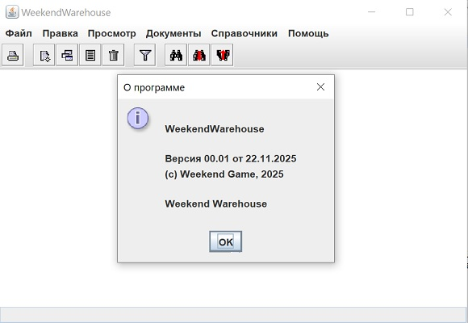
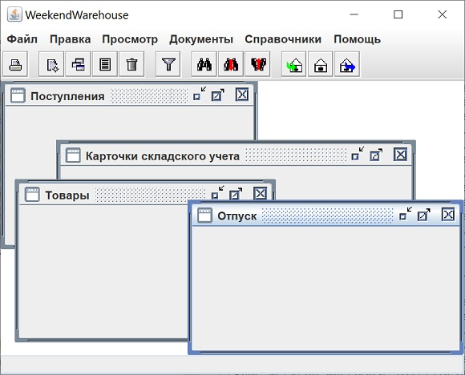
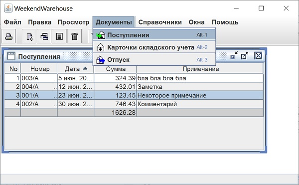
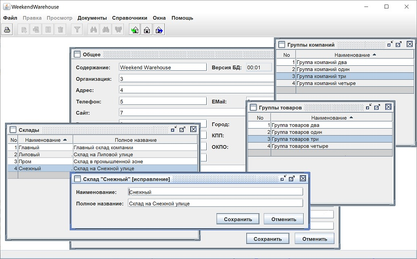
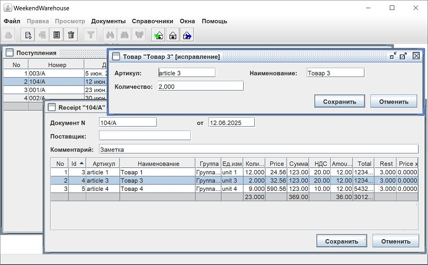

## WeekendWarehouse

#### Шаг 1 Основное окно, меню, инструментальная и статусная линейки, сообщения

В Eclipse создал Maven-проект. Сейчас это не играет никакой роли, но как только начнётся работа с СУБД, Maven будет использоваться для скачивания JDBC-драйверов.

В проекте создал два пакета: **game.weekend.framework** и **game.weekend.warehouse**. Это наглядно разделяет общий функционал для подобного класса программ и собственно реализацию складского учёта.

Все пиктограммы, необходимые для фреймворка, расположил в пакете **game.weekend.framework.images**.

Пакет **game.weekend.framework.core** содержит ядро фреймворка, как ясно из названия. Сейчас он содержит:

**Acts** - контейнер для хранения всех Actions приложения. Сейчас неочевидно, зачем нужно все Actions приложения засовывать в какой-то контейнер, но это понадобится на последующих шагах разработки.

**Loc** - локализация.

**MainFrame** - основное окно приложения, объединяющее в себе все элементы и функционал пользовательского интерфейса. MainFrame не является наследником JFrame, но его содержит. MainFrame проедоставляет публичные методы для установки меню, инструметальной линейки, строки состояния, объекту сообщений в модальных окнах. Даёт доступ к объектам: хранимых свойств приложения, сообщений, коллекции Actions используемых приложением и к JFrame выполняющего роль основного окна приложения.

**Mes** - сообщения в модальных окнах.

**Proper** - локально хранимые свойства приложения.

**StatusBar** - строка состояния приложения.

Actions для создания пунктов меню и кнопок инструментальной линейки расположены в пакете **game.weekend.framework.core.acts**.

**game.weekend.warehouse** содержит главный класс приложения WeekendWarehouse, инструментальную линейку с набором пиктограмм, меню и набор Actions, связанных со складским учётом.

Пиктограммы приложения расположены в пакете **game.weekend.warehouse.images**.

**Итак**, пока единственным рабочим элементом приложения является пункт меню "О программе...". А выглядит приложение вот так:

#### Шаг 2 Основа MDI

Окна в приложении могут быть самостоятельными. Например, журналы документов. Так журнал "Поступления", содержащий список документов отражающих поступление товара, никак не зависит от журнала "Отпуск", содержащего список документов отражающих отгрузку товара. Эти окна могут открываться в произвольном порядке и закрытие одного не влияет на другое.

Но окна могут быть и зависисмыми друг от друга. Например, открыв журнал документов "Поступления", пользователь может выбрать интересущий документ и открыть его для редактирования. Затем, не закрывая редактируемого документа, пользователь может выбрать из журнала другой документ и открыть его на редактирование. Такми образом получается, что окно "Поступления" породило окно Поступление1 и Поступление2. Теперь если пользователь закрывает журнал "Поступления", то следует закрыть и порождённые окна, а именно, окна Поступление1 и Поступление2. Но, например, в Поступление2 могли внести изменения, и следует задать вопрос пользователю, а желает ли он сохранить эти изменения и только после закрывать окно. Для решения задач, связанных с управлением окнами, создаю класс **FrameManager**. А собственно окна это объекты класса **IntFrame** (наследник JInternalFrame). IntFrame будет базовым классом для всех окон приложения.

Окна могут создавать и более сложную иерархическую структуру. Но, конечно понятно, что это затруднит работу пользователя, а значит злоупотреблять такой возможностью не следует.

FrameManager содержит метод специально предназначенный для создания внутренних окон приложения: createFrame(String className, int id, int mode). Параметер className это имя класса (с пакетом) из которого будет сделано окно. Так если надо создать окно журнала документов "Поступления", то следут указать "game.weekend.warehouse.documents.ReceiptsJournal". Параметер id это идентификатор документа. Для журнала документов "Поступления" никакого идентификатора нет, поэтому следует указать 0. А при создании окна для конкретного документа в журнале, понадобится указать его id из БД. Это даст возможность FrameManager-у понять, что если он уже создавал окно с таким id, то не следует создавать новое окно, а следует просто активизировать, вывести на передний план уже существующее. Параметер mode будет позже использоваться для того, чтобы указать следует ли открывать окно для просмотра документа, его редактирования или создания нового.

Внесены некоторые изменения в класс MainFrame. В конструкторе создаётся объект класса FrameManager. Изменен метод close(). Теперь он закроет основное окно приложения только если если удастся закрыть все внутренние окна. Добавлены методы:
* void createFrame(String className) - создать внутреннее окно приложения;
* void addIntFrame(IntFrame frame) - добавить внутреннее окно приложения в desktop;
* JInternalFrame[] getAllFrames() - получить все внутренние окна приложения.

Для удобства создания внутренних окон из Action создан класс **ActFrame**.

**Итак**, при выборе пунктов из меню "Документы" и "Справочники" появляются окна с заголовком. А выглядит приложение вот так:

#### Шаг 3

В классе IntFrame добавляю пустые методы activate() и deactivate(). Они вызываются в InternalFrameAdapter для событий активации и деактивации окна соответственно. Об их использовании напишу немного ниже.

Меню "Edit" и "View" не могут быть постоянно активны в приложении. Они содержат пункты, актуальные для большинства окон, но не для всех. Поэтому их активность должно определять текущее окно. Более того, сразу после запуска приложения нет ни одного активного окна, а значит, эти меню должны быть неактивны, как и все составляющие их пункты.

Поэтому я делаю интерфейс **IMenuBar**, который будет реализовывать класс MenuBar. В конструкторе MenuBar будет формироваться меню приложения (JMenuBar), но без "Edit" и "View". Вместо них вызываются методы:
public void defaultEditMenu()
и
public void defaultViewMenu(),
которые сформируют пустые неактивные меню.

Любое окно приложения, а оно должно быть наследником IntFrame, в методе activated(), о котором я упомянул выше, должно будет определить эти два меню из имеющихся Actions. А в методе deactivated() сделать используемые Actions неактивными.

Для отображения журналов документов и справочников создаю класс **Journal**. Для отображения документов, которые составляют журналы и справочники, создаю класс **Document**. Эти классы реализуют наиболее часто встречающиеся меню "Edit" и "View". Естественно, каждый конкретный журнал и конкретный документ могут переопределить их по-своему.

#### Шаг 4

...

#### Шаг 5 Создание первого окна документа

Документ - это поступление товаров, карточка товара, отгрузка товаров. Документ - это строка из любого справочника. Но все эти документы хранятся в БД. На данном шаге будет создан документ «Настройка программы», и хранит он наименование класса драйвера БД и строку соединения с БД. Причём сохраняет (и читает) эту информацию не в БД, а в хранимых свойствах приложения, т.е. использует класс Proper.

Документ должен прочитать информацию, отобразить её в окне для последующего редактирования пользователем и уметь сохранить данные или отменить сделанные изменения. Класс Document был создан на предшествующем шаге. Он имел только два метода: activated() и deactivated(). Они использовались для управления активностью пунктов меню и кнопок toolbar-а. Теперь добавляются ещё методы: setDocData(), getDocData(), hasChanges() и save().

Для собственно хранения информации используется объект класса DocData. Принято решения хранить все поля документа в объекте тип Map<String, Object>. Это не так быстро, как класс с набором переменных-членов повторяющих структуру документа, но для реализации UI приемлемо.

Для окна документа нужны элементы для построения пользовательского интерфейса. Для этой цели создаётся пакет game.weekend.framework.core.controls. Пакет содержит кнопки BtnOK, BtnCancel – это классы, содержащие обычные JButton. Для полей ввода сделан интерфейс IControl. Его реализует пока единственное поле ConString. Далее понадобится большой набор полей для построения интерфейса.

Из перечисленного создано окно «Настройка программы» (пакет game.weekend.framework.utility.progprop). Тут расположены составляющие его классы: ActProgProp - Action для включения в меню, ProgPropData - адаптация DocData под специфику работы окна и собственно ProgPropDoc. Добавлен соответствующий пункт в меню (MenuBar). В классе WeekendWarehouse осуществляется создание ActProgProp.

#### Шаг 6 Начало работы с СУБД

Всё необходимое для работы с СУБД уже есть. Есть даже окно, где указывается драйвер и строка соединения.

Для начала буду использовать СУБД [PostgreSQL](https://www.postgresql.org/). Далее сделаю возможной работу приложения с Oracle DBMS и Derby. Это будет интересным опытом адаптации приложения под различные СУБД.

Для работы с СУБД Postgres использую [Docker Desktop](https://www.docker.com/products/docker-desktop/). Его установка проблем не создаёт.

Всё необходимое для развёртывания Postgres расположено в папке db_postgres. В интернете много статей, посвящённых установке Postgres в среде Docker. Я использую файл docker-compose.yml. Для установки понадобится выполнить всего две команды в командной строке. Но можно и просто запустить файл make_finlet_postgres.bat. Делать это нужно только один раз. В Docker Desktop появится контейнер finlet_postgres, который можно запускать или останавливать, пользуясь GUI.

Для работы с СУБД понадобится какой-нибудь клиент баз данных. Использую [Squirrel SQL](https://squirrel-sql.sourceforge.io/). Для настройки подключения понадобится JDBC-драйвер для Postgres. Его можно взять тут: [https://jdbc.postgresql.org/download/](https://jdbc.postgresql.org/download/). Использую postgresql-42.7.3.jar - он подходит для Java 11. Строка подключения выглядит так: jdbc:postgresql://localhost:5432/finlet. Логин: finlet. Пароль: finlet. Сейчас создан только этот пользователь. Это было определено в файле docker-compose.yml. Создание большего количества пользователей будет разобрано позже, при создании справочника пользователей приложения.

После настройки подключения в Squirrel запускаю скрипт create_db_objects.sql. Скрипт создаст схему finlet, таблицу general - справочник "Общее". В таблицу помещается строка с названием БД и строка с версией БД.

Для работы с СУБД нужны JDBC-драйверы. Их можно получить с сайтов производителей СУБД, но этот проект является maven-проектом. Поэтому в файл pom.xml добавлены зависимости для трех СУБД.

Создан справочник "Общее". Он мало чем отличается от справочника «Настройка программы», но читает и записывает свои данные он не в хранимых свойствах приложения, а в БД.

Для работы с БД создан интерфейс IDB. Дело в том, что работа с БД нужна не только в пакете game.weekend.warehouse, но и в пакете game.weekend.framework. Что бы исключить зависимость фреймворка от прикладного пакета пришлось использовать интерфейс.

Создан класс для работы с БД DB. В MainFrame добавлены методы void setDB(IDB db) и IDB getDB(). В WeekendWarehouse добавлены создание DB и его установка посредством setDB(IDB db). GeneralData работает БД. Препарируемые запросы препарируются только один раз за время работы приложения.

Справочник "Общее" работает!

#### Шаг 7 Отображение документов в виде журнала

Информация о том, как следует отобразить журнал документов хранится в двух таблицах: journal_titles, где размещается информация о заголовке журнала и journal_columns, где размещается информация о каждой колонке жунала. Подразумевается, что для отображения каждого журнала документов в БД создаётся представление (view).
В описании заголовка указывается:
* name - наименование журнала для ссылок на него его в программе,
* title - заголовок окна журнала (пользовательское наименование журнала),
* fromView - имя представления которое будет использоваться для выборки документоа,
* orderBy - номер колонки по которой следует отсортировать журнал при отображении,
* rightType - тип прав доступа. Но это будет проработано позже, а пока не используется.
В описании колонок указывается:
* title_id - ссылка на заголовок,
* nono - номер колоки,
* caption - заголовок колонки (подвергается локализации),
* source - наименование поля в представлении,
* width - ширина на экране,
* sumup - флаг того, что следует в последней строке журнала отобразить сумму по данной колоке.

Если в представлении (view) будет содержаться поле с именеи no (0 AS no), то это поле будет использоваться для нумерации отображаемых строк журнала. Для удобства просмотра журнала, его чётные строки отображаются с серым фоном, а нечётные - с белым фоном. Самая последняя строка журнала это итоговоая строка. Как уже горвил, для колонок с установленным флагом в поле sumup будет рассчитана сумма по всем строкам и отображена в итоговой строке.

В файле со скриптом create_db_objects.sql добавлено создание таблиц journal_titles, journal_columns и их заполнение для журнала "Поступления". Также создаётся сам журнал "Поступления" таблица receipts (только несколько полей) и представление для его отображения v_receipts. Журнал заполняется несколькими тестовыми записями.

Отображение журнала осуществляется посредством JTable. Но что бы это сделать пришлось создать целый пакет **game.weekend.framework.core.table** со следующими классами.

**Table** содержит и управляет всем необходимым для работы JTable. JTable работает не непосредственно с деанными, а с моделью, реализацию которой делает **TableModelArrayList**. Информация о том, что должно быть отображено, загружается из таблиц journal_titles и journal_columns загружается в объект класса **TableDefinition**. Реализацию "полосок" в журнале (четные серые, нечетные белые) реализует класс **StripedRenderer**. Сорировку по колонкам, с учётом итоговой строки, релизует **SummaryTableRowSorter**. Для удобства работы вводится интерфейс **ITableModel**. На этом шаге он содержит всего пару методов, но он будет расширяться.

Использование этого пакета потребовало добавить в интерфейс IDB метод getTableDefinition() который длжен создавать объект TableDefinition и заполнять его данными. Естествеено, класс DB реализует этот метод. В конструктор Journal добавлен параметр с наименованием определения журнала и фрагмент создания табличного отображения журнала документов.

**Итак**, при выборе пункта "Поступления" из меню "Документы" или кликнув на пиктограмме с зелёной стрелкой, откроется журнал документов в табличном виде. Все документы пронумерованы в колонке No. По колонке "Сумма" расчитывается итог. Можно изменять размер колонок. Можно сортировать, кликая на заголовках колонок. А выглядит приложение вот так:

#### Шаг 8 Редактирование документов в журнале, обновление журнала

Реализую операции редактирования документа в журнале: добавить новый документ, добавить копию имеющегося (для последующего редактирования), исправить и удалить имеющийся документ. По клавише F5 или при выборе пункта меню "Обновить" делаю обновление информации, отображённой в журнале.

Немного о редактировании посредством клавиатуры и мыши.

Нажатие Enter, двойной клик на итоговой строке журнала или нажатие клавиши "+" откроет окно для создания нового документа. Нажатие клавиши "*" откроет окно для создания копии текущего документа. Нажатие клавиши Del удалит документ (естественно, предварительно спросив разрешения). 

Класс Journal теперь реализует интерфейс **IEditable**, в котором перечислены методы для всех четырёх функций редактирования. Эти методы вызываются как Actions, так и самой таблицей JTable при нажатии соответствующих клавиш и действий мышью.

**Итак**, в журнале "Поступления" можно добавлять, добавлять копии, исправлять и удалять документы (всего пару полей пока). В меню "Просмотр" журналов добавлен пункт "Обновить". А выглядит приложение вот так:

#### Шаг 9 Взгляд на дальнейшую работу. Первые справочники

За предшествующие восемь шагов было сделано, пусть и не достаточно, но много. И теперь работа по созданию программы складского учёта разделяется на два направления:

Прикладное программирование — создание складского учёта из компонентов фреймворка.

Программирование фреймворка — расширение фреймворка по мере возникновения потребностей в прикладной части и его непрерывное совершенствование.

Тут, конечно, было бы хорошо продолжить работать вдвоём. Но я делаю всё один, и поэтому буду переключаться от одной работы к другой. Да, конечно, фреймворк пока слаб. Нет поддержки работы с различными СУБД, нет многопользовательской работы (кроме того, что она предоставляет сама СУБД), из компонентов для построения окон документов есть только работа с текстовым полем, невозможно отфильтровать нужные документы, делать поиск, да много чего не хватает для построения готовой программы, которую можно передать для работы пользователям. Но даже того, что имеется, достаточно для начала работы в прикладной области. Итак.

**Справочники**

**Справочник "Общее"**

Содержит информацию (атрибуты), относящуюся ко всей БД. Справочник содержит поля: «Содержание», «Версия БД», «Организация» — полное наименование организации, в которой ведётся складской учёт в данной БД, «Адрес», «Телефон», «Email», «Сайт», «Регистрационный номер», «Город», «ИНН», «КПП», «ОКАТО», «ОКПО», «Счет», «Банк», «БИК», «К/С», «Руководитель», «Главный бухгалтер», «Бухгалтер», «Выдал С-Ф» — ФИО выдающего счета-фактуры.

**Справочник "Склады"**

Содержит перечень складов организации. Содержит следующие поля. «Наименование» — краткое, узнаваемое всеми участниками ведения учёта, название склада (это поле не может быть пустым и должно быть уникальным), «Полное наименование».

**Справочник "Группы компаний"**

Содержит перечень групп, по которым классифицируются компании, с которыми работает организация (контрагенты). Содержит только одно поле.
«Наименование» — краткое, узнаваемое всеми участниками ведения учёта, название группы. Это поле не может быть пустым и должно быть уникальным.

**Справочник "Компании"**

Содержит перечень контрагентов, с которыми работает организация. Справочник содержит поля: «Наименование» — краткое, узнаваемое всеми участниками ведения учёта, название группы (поле не может быть пустым и должно быть уникальным), «Группа» — одно из значений из справочника "Группы компаний", «Покупатель» — классификация компании как Покупатель, «Поставщик» — классификация компании как Поставщик, «Полное наименование», «Адрес», «Телефон», «Email», «Сайт», «Регистрационный номер», «Город», «ИНН», «КПП», «ОКАТО», «ОКПО», «Счет», «Банк», «БИК», «К/С», «Руководитель», «Главный бухгалтер», «Бухгалтер», «Выдал С-Ф» — ФИО выдающего счета-фактуры, «Заметка (1)» — для хранения произвольной информации, «Заметка (2)» — для хранения произвольной информации.

**Справочник "Группы товаров"**

Содержит перечень групп, по которым классифицируются товары, с которыми работает организация. Содержит только одно поле.
«Наименование» — краткое, узнаваемое всеми участниками ведения учёта, название группы. Это поле не может быть пустым и должно быть уникальным.

**Справочник "Товары"**

Содержит перечень товаров, с которыми работает организация.  Справочник содержит поля: «Артикул» — это поле не может быть пустым и должно быть уникальным, «Группа» — одно из значений из справочника "Группы товаров", «Наименование», «Единица измерения», «Ставка НДС».

**Справочник "Автонумерация"**

Поддерживает формироание номеров документов. Справочник содержит поля: «Документ», «Счётчик», «Первое значение», «Последнее значение», «Префикс», «Суффикс».

При создании нового документа ему присваивается автоматически сформированный номер. Номер формируется в виде строки по следующему правилу: берется «Префикс» (если он имеется), затем к нему добавляется значение «Счётчика», затем добавляется «Суффикс» (если имеется). После формирования номера «Счётчик» увеличивается на единицу. Если счетчик превысил «Последнее значение», то ему присваивается «Первое значение».

**Замечания по реализации**

Создание каждого справочника — это езда по хорошо знакомой дороге. Надо в файл create_db_objects.sql дописать скрипт по созданию таблицы справочника, необходимых индексов, представления для отображения, заполнить journal_titles и journal_columns определением журнала, возможно, заполнить таблицу тестовыми данными. Создать этим скриптом объекты БД. Для каждого справочника понадобится сделать четыре класса. Так, для справочника "Группы компаний" это GroupsOfCompaniesAction, где определяется Action; GroupsOfCompaniesJournal, где указывается имя определения и реализуется метод для удаления строки; GroupsOfCompaniesData, где реализуются методы для чтения, сохранения и удаления данных из/в БД; GroupsOfCompaniesDoc, где описывается окно для редактирования записи справочника. Следует в классе WeekendWarehouse создать Action и в MenuBar использовать этот Action. Следует побеспокоиться о I18n и l10n.

При создании следующего справочника действия повторяются. Отличия только в количестве полей, их типах, названиях, каких-то деталях. Для этого всего требуется доведённое до автоматизма умение это делать. Зачастую удобно скопировать всё нужное из уже сделанного справочника и внести в копию исправления, чтобы получить новый справочник (метод copy-paste). Но эта монотонная, но благодарная работа (результат виден очень быстро) продолжается только до момента, пока не окажется нужного компонента для создания интерфейса или готового метода для выполнения какой-нибудь требуемой по описанию справочника функции.

Так и у меня сегодня. Были быстро сделаны "Общее", "Склады", "Группы компаний" и "Группы товаров", затем я приступил к "Компании" — и стоп. У меня нет объекта для редактирования логического поля, нет объекта для указания группы компании. На этом прикладное программирование заканчивается, и надо переходить к программированию фреймворка. Но это завтра.

**Итак**, сделано четыре справочника: "Общее", "Склады", "Группы компаний" и "Группы товаров". А выглядит приложение вот так:

#### Шаг 10 Завершение изготовления справочников

Пришлось вернуться к программированию фреймворка и сделать объекты:
ConBoolean - ввод логического значения;
ConDecimal - ввод BigDecimal;
ConInteger - ввод целого;
ConСatBox - выбор значения из справочника в виде Combobox-а. Отображает список имён и при выборе заносит в управляемое им поле ID этой строки.
 
И заготовку на будущее: ConDate.

А затем вернулся к прикладному программированию и завершил создание недостающих справочников.

**Итак**, сделано три справочника: "Компании", "Товары" и "Автонумерация". Все необходимые справочники имеются!

#### Шаг 11 Документ со списком

Все окна документов (карточек), созданные для редактирования справочников, не содержат списков. Такие документы, как "Поступление" или "Отгрузка", список содержат. А это значит, что продолжать прикладное программирование невозможно. На этом шаге делаю документ со списком.

Для этого класс TableModelArrayList пришлось заменить двумя классами: TableModelDB - это модель, работающая с таблицами БД, и TableModelAL - это модель, работающая с ArrayList, в который предварительно была прочитана информация. FrameManager получил разновидность метода createFrame(), принимающий список для последующей передачи окну-наследнику IntFrame. Собственно, документ со списком - это DocumentWithAList, являющийся наследником Document. Его особенностью является содержание методов для редактирования списка.

**Итак**, сделанное опробовано в окне для редактирования поступления.

