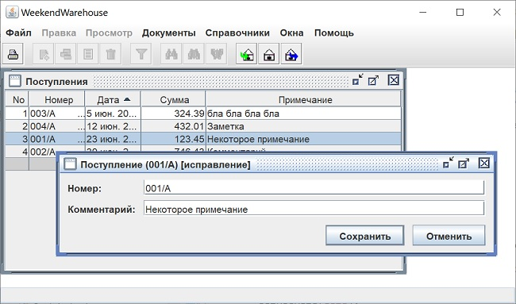

## WeekendWarehouse

But before we start working with the DBMS, we need to implement MDI, or at least the basics.

##### Step 1

...

##### Step 2

...

##### Step 3

In the IntFrame class, I add empty methods activate() and deactivate(). They are called in the InternalFrameAdapter for window activation and deactivation events, respectively. I'll describe their use below.

The "Edit" and "View" menus can't be permanently active in an application. They contain items relevant to most windows, but not all. Therefore, their activity should be determined by the current window. Moreover, immediately after the application starts, there is no active window, meaning these menus, as well as all the items they contain, should be inactive.

Therefore, I create the **IMenuBar** interface, which the MenuBar class will implement. The MenuBar constructor will generate the application menu (JMenuBar), but without the Edit and View menus. Instead, it calls the following methods:
public void defaultEditMenu()
and
public void defaultViewMenu(),
which generate empty, inactive menus.

Any application window that inherits IntFrame must define these two menus from the available actions in the activated() method mentioned above. And in the deactivated() method, it must deactivate the actions used.

To display journals and document directories, I create a **Journal** class. To display the documents that make up the journals and directories, I create a **Document** class. These classes implement the most commonly used Edit and View menus. Naturally, each specific journal and document can override them in its own way.

##### Step 5: Creating the First Document Window

A document is a product receipt, product card, or product shipment. A document is a row from any directory. However, all these documents are stored in the database. In this step, the "Program Setup" document will be created. It stores the name of the DB driver class and the DB connection string. It stores (and reads) this information not in the DB, but in the application's stored properties, i.e., it uses the Proper class.

The document must read the information, display it in a window for subsequent user editing, and be able to save the data or discard the changes. The Document class was created in the previous step. It had only two methods: activated() and deactivated(). These were used to control the activity of menu items and toolbar buttons. Now, additional methods are added: setDocData(), getDocData(), hasChanges(), and save().

A DocData class object is used to store the actual information. It was decided to store all document fields in a Map<String, Object> object. This isn't as fast as a class with a set of member variables that replicate the document structure, but it's acceptable for implementing a UI.

The document window requires elements to build the user interface. The game.weekend.framework.core.controls package is created for this purpose. This package contains the BtnOK and BtnCancel buttons—these are classes that contain regular JButtons. The IControl interface is implemented for input fields. It's currently implemented by a single ConString field. A larger set of fields will be needed later to build the interface.

The "Program Settings" window (game.weekend.framework.utility.progprop package) is created from the above. Its component classes are located here: ActProgProp (Action for including in the menu), ProgPropData (adapting DocData to the specifics of the window), and ProgPropDoc itself. A corresponding menu item (MenuBar) is added. ActProgProp is created in the WeekendWarehouse class.

##### Step 6 Getting Started with the DBMS

Everything you need to work with the DBMS is already there. There's even a window where you specify the driver and connection string.

I'll start with the [PostgreSQL](https://www.postgresql.org/) DBMS. Next, I'll enable the application to work with Oracle DBMS and Derby. This will be an interesting experience adapting the application to different DBMSs.

I use [Docker Desktop](https://www.docker.com/products/docker-desktop/) to work with the Postgres DBMS. Its installation is straightforward.

Everything you need to deploy Postgres is located in the db_postgres folder. There are many articles online about installing Postgres in a Docker environment. I use the docker-compose.yml file. Installation requires just two commands in the command line. Alternatively, you can simply run the make_finlet_postgres.bat file. You only need to do this once. A finlet_postgres container will appear in Docker Desktop, which can be started and stopped using the GUI.

To work with the DBMS, you'll need a database client. I'm using [Squirrel SQL](https://squirrel-sql.sourceforge.io/). To set up the connection, you'll need a JDBC driver for Postgres. You can get it here: [https://jdbc.postgresql.org/download/](https://jdbc.postgresql.org/download/). I'm using postgresql-42.7.3.jar, which is compatible with Java 11. The connection string looks like this: jdbc:postgresql://localhost:5432/finlet. Login: finlet. Password: finlet. Currently, only this user has been created. This was defined in the docker-compose.yml file. Creating more users will be discussed later, when creating the application's user directory.

After setting up the connection in Squirrel, I run the create_db_objects.sql script. The script will create a finlet schema, a general table, and a "General" directory. This table contains a row with the database name and a row with the database version.

To work with the DBMS, JDBC drivers are required. They can be obtained from the DBMS vendors' websites, but this project is a Maven project. Therefore, dependencies for three DBMSs have been added to the pom.xml file.

The "General" directory has been created. It's not much different from the "Program Settings" directory, but it reads and writes its data to the DB, not the application's stored properties.

The IDB interface has been created for working with the DB. This is because working with the DB is required not only in the game.weekend.warehouse package, but also in the game.weekend.framework package. To eliminate the framework's dependency on the application package, an interface had to be used.

A class for working with the DB DB has been created. The void setDB(IDB db) and IDB getDB() methods have been added to MainFrame. Database creation and installation via setDB(IDB db) have been added to WeekendWarehouse. The GeneralData database is now operational. Dissected queries are only processed once per application runtime.

The "General" directory is now operational!

#### Step 8 Editing documents in the journal, refreshing the journal

I implement document editing operations in the journal: add a new document, add a copy of an existing document (for subsequent editing), edit, and delete an existing document. Pressing F5 or selecting the "Update" menu item updates the information displayed in the journal.

A little about editing with the keyboard and mouse.

Pressing Enter, double-clicking on the journal's summary line, or pressing the "+" key will open a window for creating a new document. Pressing the "*" key will open a window for creating a copy of the current document. Pressing the Del key will delete the document (after asking permission, of course).

The Journal class now implements the **IEditable** interface, which lists methods for all four editing functions. These methods are called by both Actions and the JTable itself when the corresponding keys are pressed or mouse actions are performed.

**So**, in the "Receipts" journal, you can add, copy, edit, and delete documents (just a couple of fields for now). A "Refresh" option has been added to the "View" menu for logs. The app looks like this:

